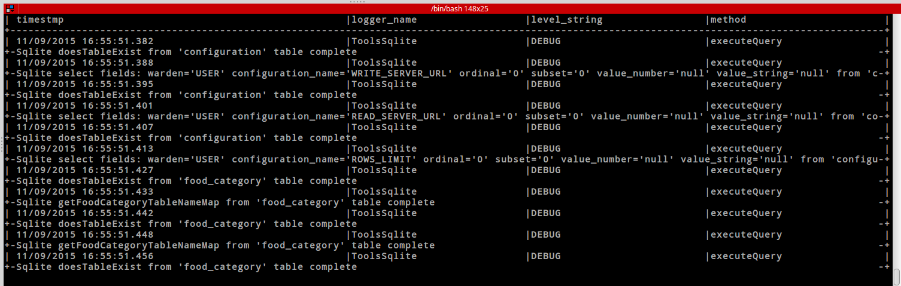

# db_logviewer
Mysql DB Appender log console viewer for logback

<p align="center">
  
  <br/>
  Example screenshot using the database log viewer.
</p>

# Features
* Uses plain text so can be used on remote machines via ssh
* Scroll up/down one line at a time with arrow up/down buttons
* Scroll up/down one page at a time with page up/down buttons
* Filter results using standard java properties file
* Choose columns shown in java properties file
* Pass in filename to use different properties file

# Properties file
To specify whether to show a column :
```
thread_name.show=false
```

To specify the minimum width of a table column :
```
timestmp.minWidth=23
```

To filter with like :
(this example will only show rows beggining with the text)
```
caller_class.like=com.rockvole.fooddb%
```

To filter with not like :
(this example will only show rows not containing the text)
```
filename.not_like=AbstractPool.java
```

The like/not_like expressions are passed to the mysql database as like/not like sql queries.
